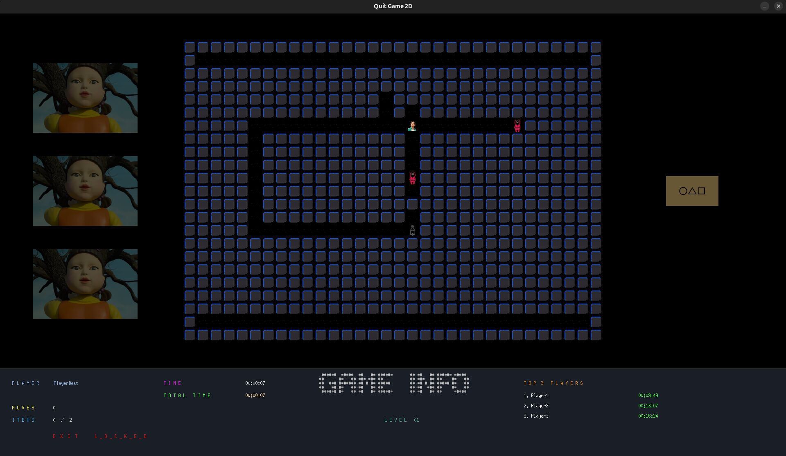

# 🎮 Quit_Game_2d 🎮

A simple 2D game where the player navigates a labyrinth, collecting items (guards) to unlock the exit and advance to the next level. The game is inspired by the Squid Game series and So_long project (42Network).

---



---

## ✨ Game Features

* **Gameplay:** Navigate a labyrinth, collect all items (Squid Game guard figures) to unlock the exit.
* **Levels:** The game consists of 8 levels. Completing the 8th level finishes the game.
* **Game End:** The game ends automatically after completing all levels. You can also exit the game at any time by pressing the `ESC` key or closing the game window (cross icon). Game state and player data are not saved in this case.
* **Statistics:** The three best game completion times are displayed in the statistics.
* **Visuals:** Simple 2D graphics.

---

## 💻 System Requirements

* **Operating System:** The game is adapted for Ubuntu (24.04.3 LTS) . It should also work on other Linux distributions.
* **Libraries:** The MinilibX library is required to run the game. It is included in the `mlx` folder, but it may be necessary to install additional system dependencies for MinilibX to function correctly (e.g., X11).

On Ubuntu, you may need to install:

```bash
sudo apt-get update
sudo apt-get install build-essential libx11-dev libxext-dev libbsd-dev
```

---

## ⚙️ Compilation

To compile the game, navigate to the project's root directory and run:

```bash
make
```

This will compile the program. To remove object files and the executable, use:

```bash
make fclean
```

---

## ▶️ Usage

After compilation, run the game using:

```bash
./Quit_Game_2d
```

Controls:

* **W, A, S, D** or **arrow keys:** Move around the labyrinth.
* **ESC** or **cross (close window):** Exit the game without saving player data.

---

## 🗺️ Map Files

Game maps are stored in files with the `.ber` extension.
Each map must be **rectangular** and enclosed by walls (`1`).

Valid characters:

* `1` → Wall
* `0` → Floor
* `P` → Player start position (only one allowed)
* `C` → Collectible item
* `E` → Exit (only one allowed)

Example:

```
111111
10C0E1
1P0C01
111111
```

---

## 🏆 Player Data & Leaderboard

The game keeps track of player names and times in a `player_data.txt` file.

* Names must be unique (3–25 alphanumeric characters).
* Typing `reset` at the name prompt clears all stored player data.
* After each completed run, results are saved and the **Top 3 players** are shown in the panel.

---

## 🛠️ Developer Notes

* Written in **C**, using the **MinilibX** library for graphics.

* Source files are organized into functional modules:

  * `map_init.c` – map loading and initialization
  * `move_utils.c` – player movement
  * `panel_utils_*.c` – rendering UI panel
  * `flood_fill.c` – map validation (reachability check)
  * `player_utils_*.c` – player data handling
  * `start_game.c` – game loop and initialization

* Compilation is managed by `Makefile`.

